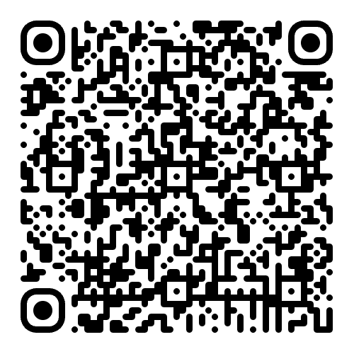

# Resilience resources

Practical tools for building projects and organisations that survive beyond any single person.

## 🎯 Upcoming sessions

### GitHub Universe 2025 - Community Day
**27 October 2025, 10am PT**

**[→ Access the session materials](sessions/github-universe-2025.md)**

Attending the session? Scan this QR code to access everything on your device:

## What's here

This repository contains frameworks, checklists, and templates for reducing your bus factor - the uncomfortable reality that most projects are one key person away from crisis.

These resources were created collaboratively by people who have actually navigated difficult transitions: maintainer departures, burnout, sudden absences, corporate spinouts, and the messy human realities of keeping projects alive through change.

## Resources

### [Legacy checklist](resources/legacy-checklist.md)
What to prepare in case you die or become suddenly incapacitated. The uncomfortable conversation nobody wants to have, with the practical details everyone needs.

### [Bus factor audit](resources/bus-factor-audit.md)
A framework for identifying single points of failure across technical systems, governance structures, and community roles.

### [Succession planning guide](resources/succession-planning-guide.md)
Templates for planning both expected and unexpected transitions. Technical handoffs, governance changes, and community leadership transfers.

### [Scenario cards](resources/scenario-cards.md)
Workshop exercises for practicing crisis response. Use these to stress-test your project's resilience with your team.

## Who this is for

These resources apply to any project or organization with key person dependencies:

* Open source projects and communities
* Nonprofits and community organizations
* Small businesses and startups
* Creative collectives and volunteer groups
* Any team where losing one person would cause a crisis

## Using these resources

Start with the **bus factor audit** to understand your vulnerabilities. Then work through the **legacy checklist** to address immediate risks. Use the **succession planning guide** to build longer-term resilience.

All resources are templates. Adapt them to your context. They get better when you make them your own.

## Contributing

These resources improve when more people share their experience. If you've navigated a difficult transition, your hard-won lessons matter.

See [CONTRIBUTING.md](CONTRIBUTING.md) for how to help.

## Origin story

These resources emerged from the "Beyond the bus factor" session at GitHub Universe 2025 Community Day, led by Ruth Cheesley (Mautic Project Lead).

They reflect real challenges: preparing for a three-month off-grid sabbatical, spinning projects out from corporate control, managing maintainer burnout, and dealing with unexpected departures.

## License

[CC0 1.0 Universal](LICENSE) - Use these resources freely. Adapt them. Share them. Make them better.

---

*Building projects that outlast us means confronting uncomfortable realities. Let's do that together.*
